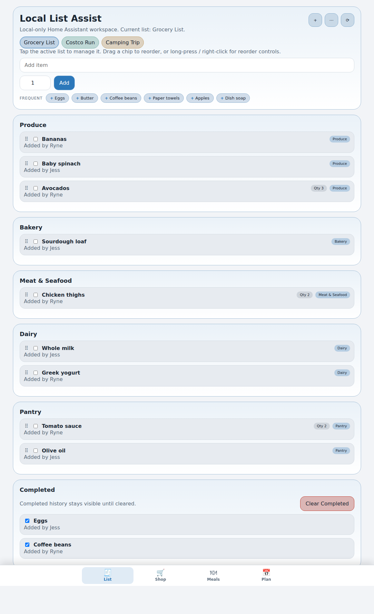
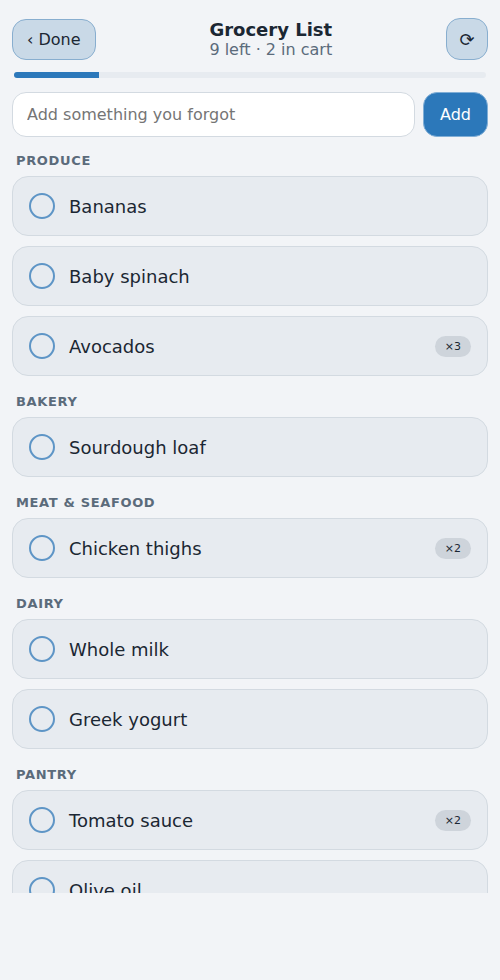
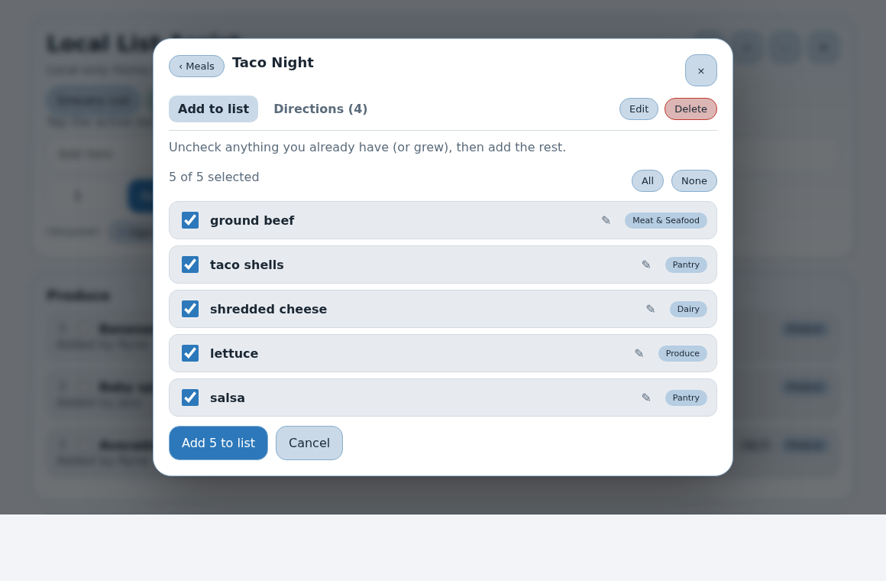
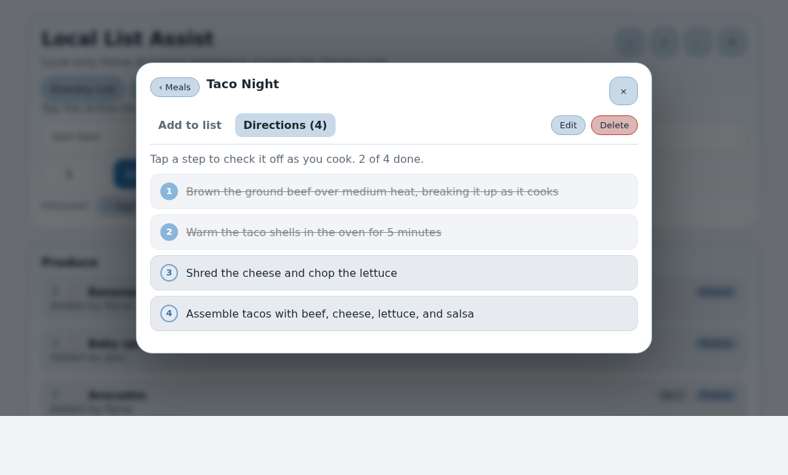
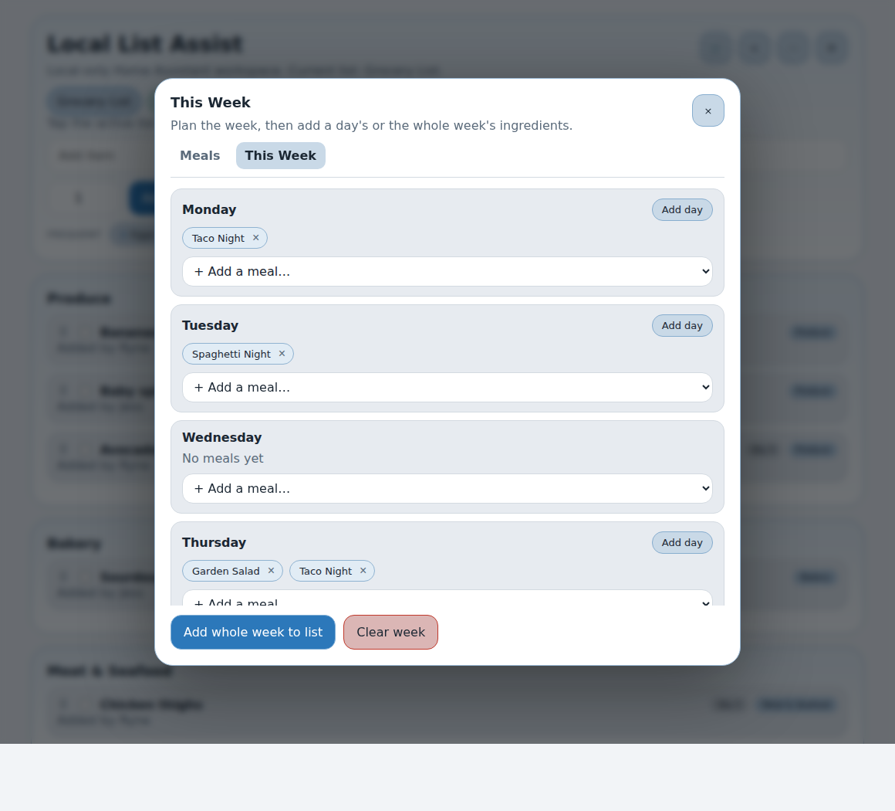
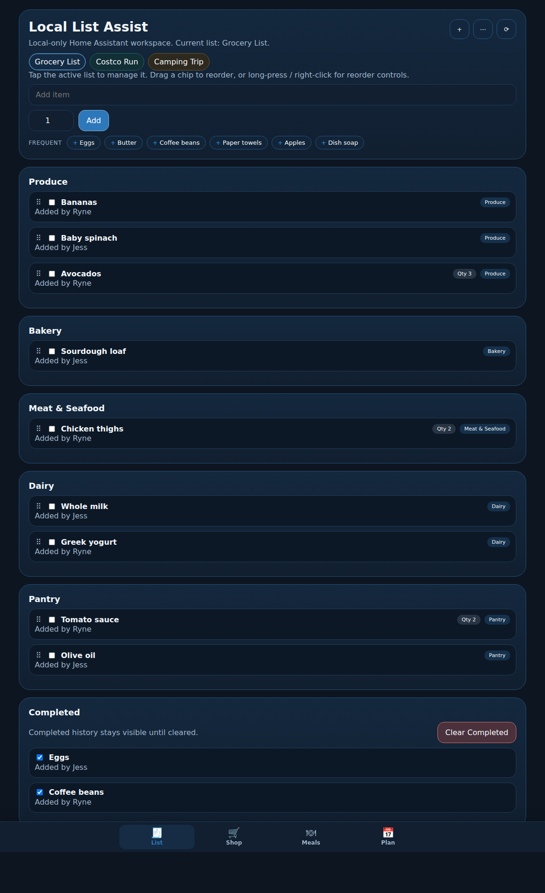
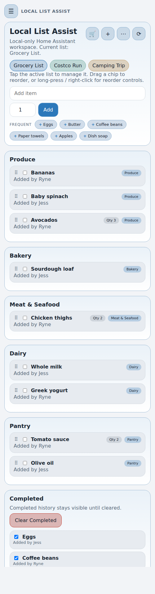

# Local List Assist

Local List Assist is a Home Assistant custom integration that gives you a local-first list app with clean list management, category-based organization, a phone-friendly Shopping Mode, one-tap frequent items, saved meals, duplicate handling, review-and-learn routing, and voice-friendly add flows.

## What It Is
- 100% Home Assistant hosted
- local-first by design
- built for household lists, errands, grocery runs, projects, camping, travel, and similar list workflows
- no cloud sync service outside Home Assistant

## Highlights
- dedicated sidebar app: `Local List Assist`
- **Shopping Mode**: a focused, big-tap-target screen for when you are at the store
- **Frequent quick-add**: one-tap chips for the items you add most often
- **saved Meals**: define a meal once (ingredients + directions), add it with a confirm checklist, and cook from the numbered steps
- **weekly meal planner**: assign meals to Mon–Sun and add a day's or the whole week's ingredients at once
- **smarter automatic categories** so far fewer items land in `Other`
- quick add with per-user attribution where Home Assistant provides user context
- multiple local lists with color theming
- category sections with per-list category order (your store walk order)
- in-place category editing in `List Settings`
- drag-and-drop reordering of items and lists
- duplicate decision flow: `Add anyway` or `Skip`
- review-and-learn flow for uncategorized items
- completed section with restore and clear support
- backup & restore: export/import all your data as a local JSON file
- follows your Home Assistant theme (light, dark, or custom)
- `App Settings` and `List Settings` inside the app
- `Activity` moved under `App Settings -> Tools`
- automatic provisioning/repair for required helpers and todo lists
- near-real-time refresh across open Home Assistant devices using Home Assistant's own state updates

## Key Features

### Shopping Mode
Tap the cart button (🛒) to switch into Shopping Mode: a stripped-down, phone-first view that shows only the unchecked items, grouped in your list's category (store) order, with large tap targets, a progress bar, and a quick add for anything you forgot. Check items off as you move through the store; tap `Done` to return to the full list.

### Frequent Quick-Add
The `FREQUENT` row above the list shows the staples you add most often as one-tap chips, so common items go on the list without typing. Suggestions appear once you have added an item a couple of times, hide anything already on the current list, and the tally survives clearing completed items.

### Saved Meals
Open `Meals` from the menu (⋯) to define a meal once — a name, its ingredients (one per line), and optionally its directions (one step per line). Tapping a meal opens a detail view with two tabs: **Add to list**, a pre-checked ingredient checklist so you just uncheck anything you already have (or grew in the garden) and add the rest; and **Directions**, a numbered step list you can tap to check off as you cook. Each ingredient is auto-categorized as it goes on the list, and meals are stored locally like everything else.

### Weekly Meal Planner
In `Meals`, switch to the **This Week** tab to assign your saved meals to Monday–Sunday. Then add a single day's ingredients or the whole week's to your list in one go — they're combined and de-duplicated across meals and shown in the same confirm checklist, so you just uncheck what you already have. The plan is stored locally and included in backups.

### Smarter Automatic Categories
Items are sorted into category sections automatically using an expanded built-in knowledge of common grocery items, with matching that prefers the most specific match (for example `tomato sauce` routes to `Pantry`, not `Produce`). When something still lands in `Other`, the review-and-learn flow lets you teach the correct category once and it sticks.

### Backup & Restore
From `App Settings -> Tools`, `Export backup` downloads a single JSON file with all your lists, saved meals, item history, and learned categories; `Import backup` restores it. Handy for moving to a new Home Assistant install or keeping a safety copy. Import replaces your current data, so run `Repair Local Setup` afterwards if you use voice.

### Theme-Aware UI
The panel follows your Home Assistant theme, so it looks at home in light, dark, or a custom theme.

## Install
### HACS
1. Install `Local List Assist` from HACS.
2. Restart Home Assistant.
3. Go to `Settings -> Devices & Services`.
4. Add `Local List Assist`.
5. Open `Local List Assist` from the sidebar.

### Manual
1. Copy `custom_components/grocery_learning` into your Home Assistant `custom_components` directory.
2. Restart Home Assistant.
3. Add the integration from `Settings -> Devices & Services`.

## Quick Start
1. Open `Local List Assist` from the sidebar.
2. Create your first list with the `+` button.
3. Add a few items with Quick Add.
4. Open `App Settings` and click `Install Voice Phrases` if you want voice adds.
5. Open `List Settings` on the active list to edit categories, color, and voice aliases.
6. If an item lands in `Other`, use the review actions once to teach the category.

## Current UI Model
- `+` button: create a new list
- active list chip: open `List Settings`
- long-press on touch or right-click on desktop: reorder lists
- hamburger menu: open navigation drawer
- `App Settings`: sync/repair/tools/links
- `Activity`: available from `App Settings -> Tools`

## Live Updates
- changes made on one Home Assistant device propagate to other open Local List Assist panels almost immediately
- panels subscribe to a WebSocket push channel and refresh when the integration reports a change; if that subscription is unavailable the panel automatically falls back to Home Assistant's normal pushed state updates
- a device ignores the update triggered by its own change, so only the other panels refresh
- active editing is protected: the panel waits to reload until dialogs/editors close

## Screenshots
| Main list | Mobile | Shopping Mode |
| --- | --- | --- |
|  |  |  |

More captures live in [docs/screenshots](docs/screenshots).

## Documentation
- Setup guide: [docs/setup.md](docs/setup.md)
- Usage guide: [docs/usage.md](docs/usage.md)
- Voice guide: [docs/voice.md](docs/voice.md)
- Troubleshooting: [docs/troubleshooting.md](docs/troubleshooting.md)
- FAQ: [docs/faq.md](docs/faq.md)
- Regression checklist: [docs/regression-checklist.md](docs/regression-checklist.md)
- Media capture checklist: [docs/media-capture-checklist.md](docs/media-capture-checklist.md)

## Service APIs
- `grocery_learning.route_item`
- `grocery_learning.add_to_list`
- `grocery_learning.install_voice_sentences`
- `grocery_learning.apply_review`
- `grocery_learning.confirm_duplicate`
- `grocery_learning.learn_term`
- `grocery_learning.forget_term`
- `grocery_learning.sync_helpers`

## Compatibility Note
- display name is `Local List Assist`
- domain and service namespace remain `grocery_learning` for compatibility

## Development
- Pure, Home-Assistant-independent logic lives in small modules (`item_logic.py`, `matching.py`, `multilist_ops.py`, `list_templates.py`, `storage.py`, `frontend/state-helpers.js`) so it can be unit tested without a Home Assistant instance.
- Run the Python tests: `python -m unittest discover -s tests -p "test_*.py"`
- Run the frontend helper tests: `node --experimental-default-type=module --test tests/test_state_helpers.mjs`
- Lint/parse gate (matches CI): `ruff check custom_components/` and `python -m compileall custom_components`
- CI (`.github/workflows/validate.yml`) runs the tests, the lint/parse gate, a byte-order-mark check, HACS validation, and hassfest.

## Support
- Issues: [https://github.com/rynecoop/ha-grocery-learning/issues](https://github.com/rynecoop/ha-grocery-learning/issues)
- Changelog: [CHANGELOG.md](CHANGELOG.md)

